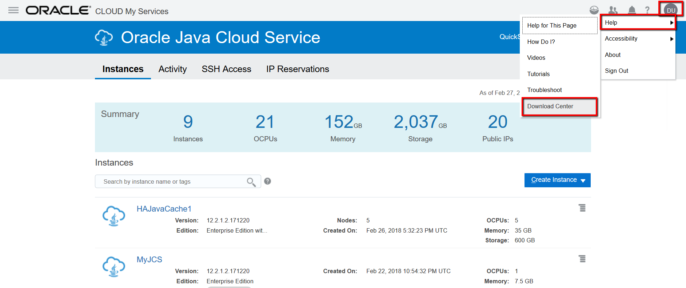
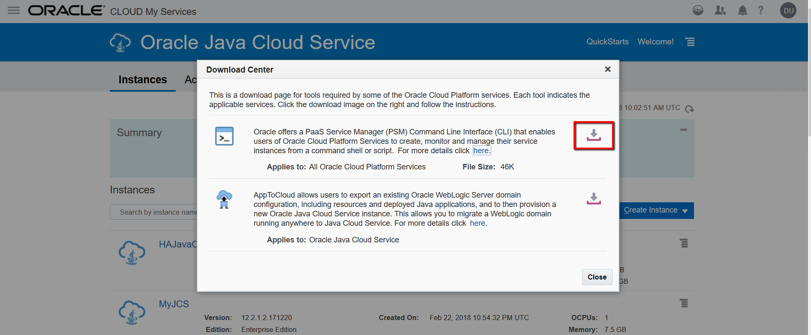
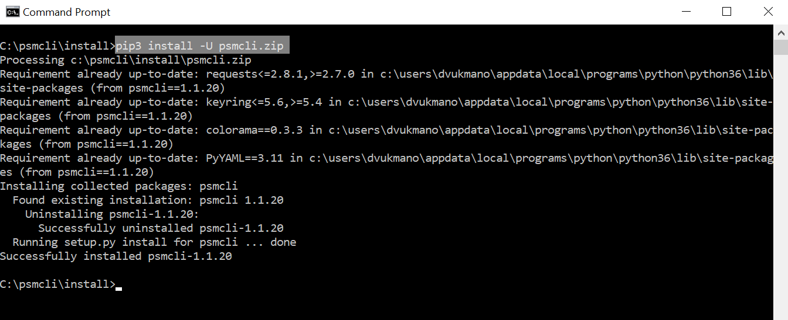
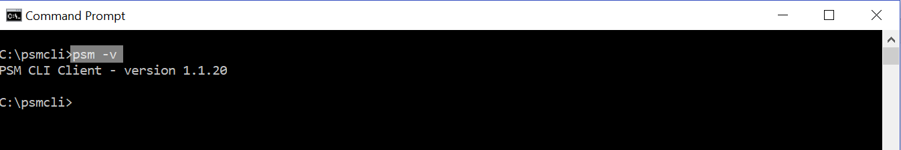
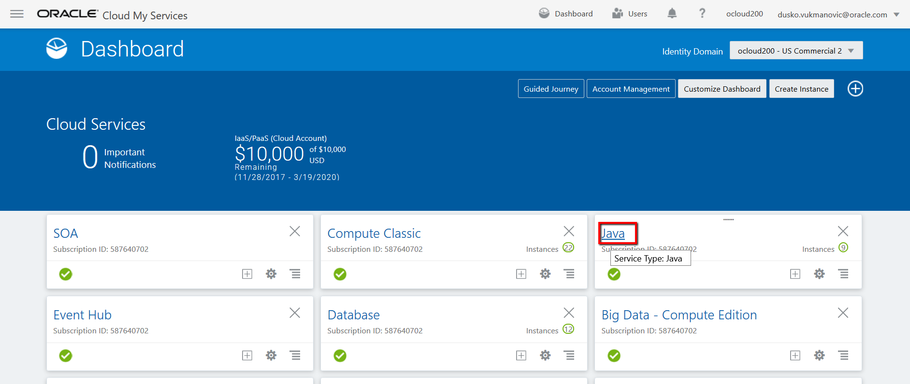
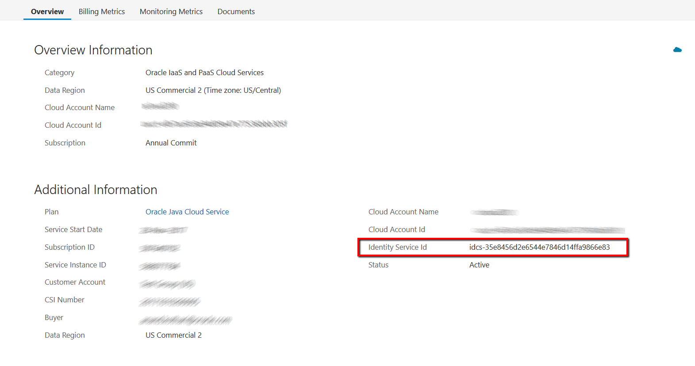
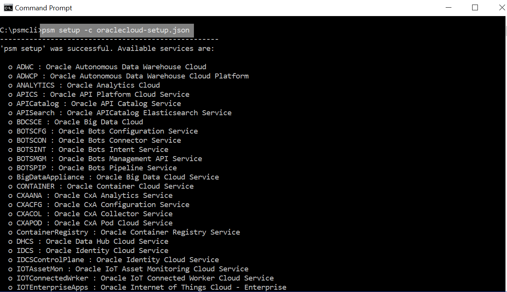
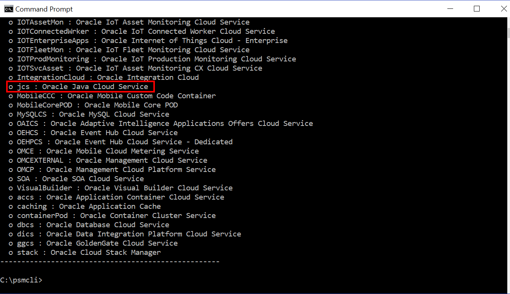
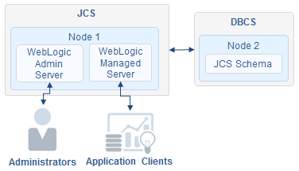
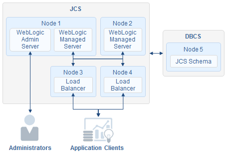

---
# ORACLE Cloud-Native DevOps workshop #

## Create Java Cloud Service instance using PSM CLI on Oracle Cloud Infrastructure (JCS on OCI) - PSM CLI JCS on OCI Quick Start ##

### Introduction ###

The Oracle Java Cloud Service (JCS) provides a cloud-based application server (Oracle WebLogic Server with automated customer-controlled provisioning, backup, patching, scaling with cloud tooling) designed to support any Java application. You may use the Oracle Java Cloud Service through the Oracle Java Cloud Service console and quickly create and configure Java EE application environment.

The Oracle Cloud Infrastructure (OCI) platform can run both Oracle workloads and cloud native applications, it offer highly available infrastructure ideal for enterprise applications and provide greater control over the network. This all adds up to great price-performance for Weblogic deployment.

In [JCSonOCI](../jcs-on-oci/README.md) lab we provisioned JCS on OCI using web user interface, Platform Services Console. Now we want to speed up provisioning by using PSM CLI tool. PSM (PaaS Service Manager) is a command line interface (CLI) tool for management of various PaaS services in Oracle Public Cloud, wrapper over PaaS REST APIs that invokes these APIs, so you can use it in your cloud automation scripts. It provides commands for tasks such as creating and deleting services, start/stop/scaling, patching, backup, monitoring and much more.

### About this tutorial ###
This tutorial shows how to use PSM CLI while creating Java Cloud Service (JCS) instance on Oracle Cloud Infrastructure (OCI).

Note: The content of the CLI response is based on the resources defined in your environment. Your response may not match the examples shown in this tutorial.

### Scenario ###
You have subscriptions to Oracle Public cloud and you did setup prerequisites for Oracle Platform Services on Oracle Cloud Infrastructure (first step in JCSonOCI lab), and provisioned Oracle Database Cloud (Database as a Service) instances on OCI (second step in JCSonOCI). 
Now, you want to learn how to create different environments for Java applications using PSM CLI. This tutorial shows you how create three kind of environments. Specifically, you will create the following environments (environments are based on QuickStart Templates with some changes):
-	Simple Java Web App – single node WL EE serve (1 OCPU)
-	Multi-Tier Java EE App with High Availability – two node WL EE cluster with two OTD (4 OCPU)
-	Highly Available Java EE App with Caching – two node WL Suite cluster, two OTD, one node Coherence (5 OCPU)

### Prerequisites ###
To complete this tutorial, you need:
-	Provisioned DBCS on OCI
-	Python 3.3 or later. For more information about downloading and using Python, go to python.org. You will also have to use the PIP tool pip3 to install the CLI Python package.
Note: While installing Python, make sure to select the check box Add Python to PATH.
-	Have the appropriate credentials for working with Oracle Java Cloud Service.

### PSM CLI setup ###
Documentation for PSM CLI setup that includes steps for Windows and Linux platform is [here](https://docs.oracle.com/en/cloud/paas/java-cloud/pscli/using-command-line-interface-1.html), I will show here steps for Windows platform.
First, download PSM CLI binaries from any PaaS service console. Click on your username, then help and then Download Center.

On the download page click the download image on the right and follow the instructions to save psmcli.zip into folder on local disk.


Install the PaaS CLI as a Python package. Use the PIP tool pip3 to install the CLI Python package. PIP is already installed if you are using Python 2 >=2.7.9 or Python 3 >=3.4 binaries downloaded from [python.org](https://www.python.org/), if you need to upgrade you can follow this steps for [upgrade pip](https://pip.pypa.io/en/stable/installing/#upgrading-pip).
```
>pip3 install -U psmcli.zip
```


First psm command that we are using here to check if psm is available and version is:
```
>psm –v
```


Now we have to connect to Oracle Cloud where we will be manage resources. For this, you can run the setup command, ```psm setup```, and when prompted, enter your cloud user name, password, and identity domain. In order to avoid the prompt-by-prompt routine described above we will use profile. You can create different profiles as JSON files, based on region, credentials, identity domain, and so on and quickly configure your CLI client by passing the profile as a payload. This is helpful if you have multiple configuration profiles (for example, one for each account) as you can use the appropriate profile to access any account.
Before you run psm setup command, if your machine requires a proxy server in order to connect to the Internet, set the http_proxy and https_proxy environment variables.
```
set http_proxy=http://myproxy.oracle.com:80
set https_proxy=https://myproxy.oracle.com:80
```
Below is the example of profile used in this workshop with parameter comments so you cannot copy/paste it as is, remove comment or use source code from here, [oraclecloud-setup.json](payloads/oraclecloud-setup.json).
```
{ 
    "username":" john.smith@example.com", //Username for the account.
    "password":" aZerty12", //Password associated with the specified username.
    "identityDomain":"idcs-35w8456d2e6544e6736s14ffa9866e73", //Identity domain associated with the specified user. If you are configuring your CLI for use with Identity Cloud Service (IDCS), you need to enter your IDCS tenant name rather than your identity domain. The IDCS tenant name is usually a lengthy string of characters preceded by a service ID, for example, idcs-6572bfeb183b4becad9e649bfa14a488. Below are steps to find Identity Domain for IDCS enabled accounts.
    "region":"us", //The cloud data center region”us”, “emea”, “aucom”
    "outputFormat":"short" //Output of psm command, “short”, “json”, “html”
}
```
How to find Identity Domain for IDCS enabled accounts:
To find your IDCS tenant name: when you login, on the Cloud Dashboard page click on any service name, Java in this example.

You will find Identity Service Id on the right side.


Having successfully created profile file and entered data you can run psm command to connect to our cloud account.
```
>psm setup -c oraclecloud-setup.json
```




After successful connection, we are ready for new commands. You can try some of commands below before we start provision environments:
- Description of all commands related to jcs service: ```>psm jcs h```
- List of available services in your account: ```>psm jcs services```
- Description of particular “MyJCS” jcs service: ```>psm jcs service -s MyJCS```
- Checks health of the “MyJCS”service: ```>psm jcs check-health -s MyJCS```

Try those commands also with changing output format to json by adding “-of json” on the end of each command, for example:
```>psm jcs check-health -s MyJCS –of json```

Note that default output was in “short” format since we setup this format in our profile file, if you want to use “json” as default format that you can change this parameter in profile file.

Command that we wil use to provision jcs environment is:
```> psm jcs create-service -c create-jcs-payload.json```

Ful description of that command you can check with:
```>psm jcs create-service h```

We will continue with examples for provisioning different jcs environments. At the beginning of each lab you can see diagram of environment that will be provisioned, then payload file with comments (comments you have to remove if you will use copy/paste) and source code at the end. We will start with simpler environment and adding more details in subsequent environments. Attributes used in payload file are most common one; it is not full list of all attributes.

### Provisioning of Simple Java Web App environment (single node WL EE serve (1 OCPU)) ###
This environment is comprised of a single Oracle WebLogic Server node.


PSM CLI Payload:
```
{
	"availabilityDomain":"QnsC:PHX-AD-1", 
	"backupDestination":"NONE", //Whether to enable backups for this Oracle Java Cloud Service instance. NONE - Do not enable backups. This means automated scheduled backups are not enabled, and on-demand backups cannot be initiated.
	"edition":"EE", // Software edition for Oracle WebLogic Server. SE - Standard edition, scaling a cluster is not supported. EE - Enterprise Edition. This is the default for both PAAS and BASIC service levels.
	"enableNotification":"true",  //Whether to enable (true) or disable (false) notifications by email. If this property is set to true, you must specify a value in notificationEmail. Notifications are sent when service instance provisioning is successful or not successful.
	"meteringFrequency":"HOURLY", //HOURLY - Pay only for the number of hours used during your billing period, must be HOURLY for Universal Credits subscription.
	"notificationEmail":"john.smith@example.com",  //The email that will be used to send notifications to.
	"provisionOTD":"false", //Whether to enable a local load balancer for the service instance. The default value is true when you configure more than one Managed Server for the Oracle Java Cloud Service instance.
	"region":"us-phoenix-1", //Name of the region where the Oracle Java Cloud Service instance is to be provisioned. The Oracle Database Cloud Service database deployment on Oracle Cloud Infrastructure must be in the same region and virtual cloud network as the Oracle Java Cloud Service instance you are creating on Oracle Cloud Infrastructure. The service instances do not need to be on the same subnet or availability domain.
	"serviceDescription":"Simple Java EE",
	"serviceLevel":"PAAS", //PAAS- Production-level service. This is the default. Supports Oracle Java Cloud Service instance creation and monitoring, backup and restoration, patching, and scaling.
	"serviceName":"SimpleJava", //Must: not exceed 30 characters, start with a letter, contain only letters and numbers, not contain any special characters (including hyphens), unique within the identity domain. The names of the domain and cluster in the service instance will be generated from the first eight characters of the service instance name (serviceName), using the following formats, respectively:first8charsOfServiceInstanceName_domain, first8charsOfServiceInstanceName_cluster
	"serviceVersion":"12cRelease212", //Oracle WebLogic Server software version. Valid values are: 12cRelease212 (default), 12cR3 and 11gR1.
	"subnet": "ocid1.subnet.oc1.phx.aaaaaaaasrksg2vphnzthx2biars2mxa6fiibx4tbhs2jpmakjlorxmbhbyq", //A subnet exists in a single availability domain and consists of a contiguous range of IP addresses that do not overlap with other subnets in the cloud network. The subnet must already be created in the specified availability domain. The Oracle Database Cloud Service database deployment on Oracle Cloud Infrastructure must be in the same region and virtual cloud network as the Oracle Java Cloud Service instance you are creating on Oracle Cloud Infrastructure. The service instances do not need to be on the same subnet or availability domain. However, if the service instances are on different subnets, your Oracle Java Cloud Service instance backup will fail if the backup is configured to include a backup of the associated Oracle Database Cloud Service database deployment. Note that value for this attribute is Oracle Cloud ID (OCID). Every Oracle Cloud Infrastructure resource has an Oracle-assigned unique ID called an Oracle Cloud Identifier (OCID). It's included as part of the resource's information in ihe OCI Console.
	"vmPublicKeyText":"ssh-rsa AAAAB3NzaC1yc2EAAAADAQABAAABAQCL92Bj/2xoAZoEaZmNcLIIA88lmX/4of94NR4OC/p5k3isHBiJ/435+gQXPfqyQO8fN9neC9crVBoB5k4mWUTMTNR/vDAJQw6k3aNNSRKZHmMDi1x6dArqJAs6xQhz3HH+jDpItfW+807DARLAPBcUOtTVeE09KDmDvABNSiI3Qa50gkyUu58GQJ53ZpcfByo9YWRwWOYOWP6q/f/S/Dsm8fm92r284q2jbnOdgvjq7xf4ju3PdoqhfN4jjajpslerNDwt/uZ+UUqzAeJG7QKz6oUVYYHrmPXyc4ouVrZu9O5OxQLg5HjpLIQjY9exVG82Cg/LU+fnmyfTjQ8hj4kl", //The public key for the secure shell (SSH). This key will be used for authentication when connecting to the Oracle Java Cloud Service instance using an SSH client.
	"components":{
		"WLS":{
			"adminPassword":"Ach1z0#d", //Password for the WebLogic Server administrator.
			"adminUserName":"weblogic", //User name for the WebLogic Server administrator.
			"dbaName":"sys", //User name for the database administrator. For service instances based on Oracle WebLogic Server 12c(12.2.1 and 12.1.3), this value must be set to a database user with SYSDBA system privileges. You can use the default user SYS or a user that has been granted the SYSDBA privilege. Only an Oracle Java Cloud Service instance based on WebLogic Server 12.2.1 can use a required schema database deployment that is created using the Oracle Database 12.2 version. To ensure that you can restore the database for an Oracle Java Cloud Service instance without risking data loss for other service instances, do not use the same Database Cloud Service database deployment with multiple Oracle Java Cloud Service instances. When provisioning a service instance in a specific region, specify a Database Cloud Service database deployment that is in the same region. When provisioning a production-level Oracle Java Cloud Service instance, you must use a production-level Database Cloud Service. The backup option for that database deployment cannot be NONE.(Not applicable to Oracle Cloud Infrastructure)  The Oracle Database Cloud Service database deployment on Oracle Cloud Infrastructure must be in the same region and virtual cloud network as the Oracle Java Cloud Service instance you are creating on Oracle Cloud Infrastructure, but the service instances do not have to be on the same subnet. In this release, however, if the service instances are on different subnets, your Oracle Java Cloud Service instance backup will fail if the backup is configured to include a backup of the associated Oracle Database Cloud Service database deployment. An Oracle Database Cloud Service database deployment based on a RAC database is not supported. 
			"dbaPassword":"Ach1z0#d", //Password for the Database administrator that was specified when the Database Cloud Service database deployment was created.
			"dbServiceName":"SimpleDBCS", //Name of the database deployment on Oracle Database Cloud Service to host the Oracle schemas required for this Oracle Java Cloud Service instance.
			"managedServerCount":"1", //Number of Managed Servers in the WebLogic Server application cluster. This attribute is ignored if clusters array is used. Valid values include: 1, 2, 4, and 8. The default value is 1.
			"sampleAppDeploymentRequested":"true", //Whether to automatically deploy and start the sample application, sample-app.war, to the default Managed Server in your service instance. The default value is false.
			"shape":"VM.Standard1.1" //Desired compute shape for the node. A shape defines the number of Oracle Compute Units (OCPUs) and amount of memory (RAM).The valid shapes on Oracle Cloud Infrastructure includes the VM.Standard1, VM.Standard2 and BM.Standard1, BM.Standard2 shapes.
		}	
	}
}
```
Payload source code: [create-jcs-oci-SimpleJava.json](payloads/create-jcs-oci-SimpleJava.json)

PSM command: ```>psm jcs create-service -c create-jcs-oci-SimpleJava.json```

After you provision this environment, try this command below and compare output with payload:

```>psm jcs service –s JavaServiceName –of json```

### Provisioning of Multi-Tier Java EE App with High Availability – two node WL EE cluster with two OTD (4 OCPU) ###
This Oracle Java Cloud Service environment is comprised of two Oracle WebLogic Server nodes to ensure maximum availability. External clients access your applications through a two active load balancer nodes.


PSM CLI Payload:
```
{
	"availabilityDomain":"QnsC:PHX-AD-2",
	"backupDestination":"NONE",
	"edition":"EE",
	"enableNotification":"true",
	"meteringFrequency":"HOURLY",
	"notificationEmail":"john.smith@example.com ", 
	"provisionOTD":"true",
	"region":"us-phoenix-1",
	"serviceDescription":"Multi-Tier Java EE High Availability",
	"serviceLevel":"PAAS",
	"serviceName":"MultiTierJava",
	"serviceVersion":"12cRelease212",
	"subnet": "ocid1.subnet.oc1.phx.aaaaaaaa5yi47ksp5keilshdfqqqued33mssero4ih22axa5lv5xa6lbp3vq",
	"vmPublicKeyText":"ssh-rsa AAAAB3NzaC1yc2EAAAADAQABAAABAQCL92Bj/2xoAZoEaZmNcLIIA88lmX/4of94NR4OC/p5k3isHBiJ/435+gQXPfqyQO8fN9neC9crVBoB5k4mWUTMTNR/vDAJQw6k3aNNSRKZHmMDi1x6dArqJAs6xQhz3HH+jDpItfW+807DARLAPBcUOtTVeE09KDmDvABNSiI3Qa50gkyUu58GQJ53ZpcfByo9YWRwWOYOWP6q/f/S/Dsm8fm92r284q2jbnOdgvjq7xf4ju3PdoqhfN4jjajpslerNDwt/uZ+UUqzAeJG7QKz6oUVYYHrmPXyc4ouVrZu9O5OxQLg5HjpLIQjY9exVG82Cg/LU+fnmyfTjQ8hj4kl",
	"components":{
		"WLS":{
			"adminPassword":"Welcome1#",
			"adminUserName":"weblogic",
			"dbaName":"sys",
			"dbaPassword":"Welcome1#",
			"dbServiceName":"Alpha02PHAD1",
			"managedServerCount":"2",
			"sampleAppDeploymentRequested":"true",
			"shape":"VM.Standard1.1"
		},
        "OTD":{
            "haEnabled":"true", //Whether the local load balancer HA is enabled. This value defaults to false.
            "loadBalancingPolicy":"LEAST_CONNECTION_COUNT", //Policy to use for routing requests to the Managed Servers. LEAST_CONNECTION_COUNT - Passes each new request to the Managed Server with the least number of connections. This is the default. LEAST_RESPONSE_TIME - Passes each new request to the Managed Server with the fastest response time. ROUND_ROBIN - Passes each new request to the next Managed Server in line, evenly distributing requests across all Managed Servers regardless of the number of connections or response time.
            "shape":"VM.Standard1.1"
        }		
	}
}
```
Pyload Source code: [create-jcs-oci-MultiTierJava.json](payloads/create-jcs-oci-MultiTierJava.json)

PSM command: ```>psm jcs create-service -c create-jcs-oci-MultiTierJava.json```

After you provision this environment, try this command below and compare output with payload:

```>psm jcs service –s JavaServiceName –of json```


